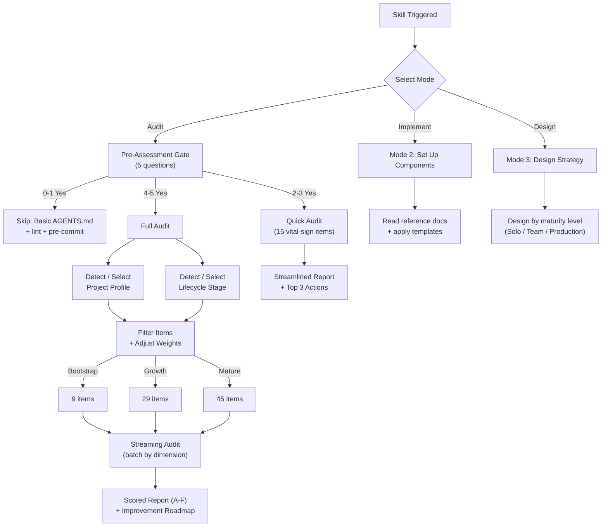

# Harness Engineering Guide

A comprehensive skill for auditing, designing, and implementing environment constraints and feedback loops for AI coding agents. Supports **Quick Audit** (15 vital-sign items) and **Full Audit** (45 items) across **10 project profiles**, **11 language ecosystems**, **3 lifecycle stages**, **25 anti-patterns**, and **6 platform adapters**.

## What is Harness Engineering?

**Agent = Model + Harness.** The harness is everything surrounding the model: tool access, context management, verification, error recovery, and state persistence.

From a control theory perspective, every effective harness implements four elements:

| Element | In the Harness | Example |
|---------|---------------|---------|
| **Goal State** | Architecture docs, quality standards, done criteria | ARCHITECTURE.md, lint rules |
| **Sensor** | Tests, linters, logs, metrics, screenshots | CI checks, Playwright |
| **Actuator** | Auto-fix, CI gates, rollbacks, refactoring PRs | pre-commit hooks, blocked PRs |
| **Feedback Loop** | CI fail→fix→pass, review→lint rule | quality score trends |

Missing any one element makes the system **open-loop** — unable to self-correct.

## Quick Start

Say any of the following to an AI agent to trigger this skill:

- "Review my repo for AI coding readiness"
- "Audit this repo's harness maturity"
- "Quick check my repo's harness health"
- "Set up AGENTS.md for my project"
- "Design a harness strategy for my new project"
- "Why does my AI agent keep writing bad code?"

## Three Modes

### Mode 1: Audit
Evaluate the repo's harness maturity across 8 dimensions. Two depth levels:

- **Quick Audit** — 15 vital-sign items covering all 8 dimensions. Streamlined report with Top 3 actions. ~30 minutes. Triggered by Pre-Assessment Gate (2-3 Yes) or `--quick` flag.
- **Full Audit** — All 45 items scored. Configurable by **project type profile** and **lifecycle stage**. Outputs an A–F graded report with a detailed improvement roadmap. Supports monorepo per-package auditing.

### Mode 2: Implement
Set up specific harness components on demand: AGENTS.md, CI pipelines, lint rules, testing strategies, and more. Templates available for multiple CI platforms and language ecosystems.

### Mode 3: Design
Design a complete harness strategy scaled to team size, across three maturity levels (Solo / Small Team / Production).

## How It Works



## Features

### Project Type Profiles (10 profiles)
Adjusts audit dimension weights and skips irrelevant items based on project type. Legacy fine-grained names (e.g., `frontend-spa`) are mapped to the primary profile via `profile_aliases`.

| Profile | Covers | Focus |
|---------|--------|-------|
| `frontend` | SPA, SSR/SSG, browser extensions | UI visibility, E2E testing, component architecture |
| `backend` | API services, microservices | Observability, safety, distributed tracing |
| `fullstack` | Monolithic full-stack apps | Default weights, dependency direction |
| `library` | Libraries, CLI tools, packages | Testing, mechanical constraints, reduced observability |
| `client-app` | Desktop, mobile apps | UI automation, multi-process architecture |
| `system-infra` | OS-level, embedded, games, smart contracts | Safety, rollback, type safety |
| `data-ml` | ML pipelines, ETL, data processing | Long-running tasks, durable execution, progress tracking |
| `devops-iac` | IaC, scripts, automation | Safety rails, human confirmation, rollback |
| `monorepo` | Multi-package repositories | Cross-package boundaries, entropy management |
| `ai-agent-runtime` | Agent frameworks, LLM orchestrators | Session persistence, tool protocol trust, agent observability |

### Lifecycle Stages (3 stages)
Reduces audit scope for projects at different maturity levels:

| Stage | Active Items | Focus |
|-------|-------------|-------|
| **Bootstrap** (<2k LOC) | 9 items | Foundations only |
| **Growth** (2k-50k LOC) | 29 items | Constraints + testing + early feedback |
| **Mature** (50k+ LOC) | 45 items | Full audit |

### Multi-Ecosystem Support (11 ecosystems)
Detection rules, tool recommendations, and CI commands for:
Node.js/TypeScript, Python, Go, Rust, Ruby, Java, C#/.NET, Swift, Kotlin, Dart/Flutter, PHP

**Boundary enforcement templates** (item 2.5) available for 6 ecosystems:
ESLint (JS/TS), import-linter (Python), depguard (Go), clippy + Cargo workspace (Rust), ArchUnit (Java), deptrac (PHP).
Other ecosystems provide detection + CI commands; boundary rules require manual setup.

### Pre-Assessment Gate
A 5-question triage that routes to the right audit depth:

| "Yes" Count | Route | Description |
|-------------|-------|-------------|
| **4-5** | Full Audit | 45 items, detailed report with improvement roadmap |
| **2-3** | Quick Audit | 15 vital-sign items, streamlined report, ~30 min |
| **0-1** | Skip | Basic AGENTS.md + pre-commit hook + lint setup |

### Enhanced Audit Scripts
Content-level analysis beyond file existence:
- Structured logging framework detection
- Metrics/tracing configuration detection
- AGENTS.md quality analysis (line count, doc links, command refs)
- Tech debt density scanning (TODO/FIXME/HACK)
- Monorepo auto-detection and package discovery
- **Blueprint mode**: gap analysis with prioritized recommendations and template mappings
- **Persist mode**: save blueprint to `harness-system/MASTER.md` for cross-session reuse
- **Quick mode**: 15 vital-sign items for fast triage (`--quick` / `-Quick`)
- **Multiple output formats**: JSON, Markdown, Blueprint
- **Data validation**: Automated consistency checks for data files (stages.json, profiles.json, checklist-items.json)

### Multi-Platform Templates
- **CI**: GitHub Actions, GitLab CI, Azure DevOps
- **Linting boundaries**: ESLint (JS/TS), import-linter (Python), depguard (Go), clippy (Rust), ArchUnit (Java), deptrac (PHP)
- **Environment recovery**: Bash and PowerShell

## Directory Structure

```
harness-engineering-guide/
├── SKILL.md                           ← Agent entry point (~190 lines, thin orchestrator + Quick Reference)
├── skill.json                         ← Skill metadata (name, version, platforms, keywords)
├── README.md                          ← You are here (English)
├── README.zh.md                       ← Chinese version
├── data/
│   ├── profiles.json                  ← 10 project type profiles with variants and weight overrides
│   ├── stages.json                    ← 3 lifecycle stages with active item subsets
│   ├── ecosystems.json                ← 11 ecosystem detection rules and tool mappings
│   └── checklist-items.json           ← 45 items in machine-readable format
├── scripts/
│   ├── harness-audit.sh               ← CLI + scoring + output formatting (Bash)
│   ├── harness-audit.ps1              ← CLI + scoring + output formatting (PowerShell)
│   ├── validate-data-consistency.sh   ← Data integrity validation (Bash)
│   ├── validate-data-consistency.ps1  ← Data integrity validation (PowerShell)
│   └── utils/
│       ├── dimension-scanners.sh      ← All 8 dimension detection logic (Bash)
│       └── dimension-scanners.ps1     ← All 8 dimension detection logic (PowerShell)
├── templates/
│   ├── universal/                     ← Language-agnostic templates (5 files)
│   ├── ci/                            ← CI templates: GitHub Actions, GitLab, Azure
│   ├── linting/                       ← Boundary rules: ESLint, import-linter, depguard, clippy, ArchUnit, deptrac
│   └── init/                          ← Environment recovery: Bash, PowerShell
├── reports/                           ← Audit report output directory
├── examples/                          ← Example audit reports
├── references/                        ← Deep-dive reference docs (20 files)
│   ├── adversarial-verification.md    ← Adversarial verification (patterns + prompt template + platform guide)
│   ├── anti-patterns.md               ← 25 anti-patterns with quick diagnostic table
│   ├── checklist.md                   ← 8-dimension, 45-item audit checklist
│   ├── scoring-rubric.md              ← Scoring, disambiguation, maturity annotations, conservatism calibration
│   ├── report-format.md               ← Audit report template and naming conventions
│   ├── control-theory.md              ← Control theory foundation
│   ├── improvement-patterns.md        ← Quick wins, strategic investments, metrics, sticking points
│   ├── automation-templates.md        ← Gap-driven template decision tree
│   ├── agents-md-guide.md             ← AGENTS.md authoring guide
│   ├── ci-cd-patterns.md              ← CI/CD pipeline patterns
│   ├── linting-strategy.md            ← Linting & type checking strategy
│   ├── testing-patterns.md            ← Testing strategy
│   ├── review-practices.md            ← Code review practices
│   ├── long-running-agents.md         ← Multi-session agent patterns
│   ├── agent-team-patterns.md         ← Multi-agent coordination (6 topologies)
│   ├── platform-adaptation.md         ← Cross-platform config mapping (6 platforms)
│   ├── cache-stability.md             ← Cache stability & context management
│   ├── durable-execution.md           ← Durable execution & crash recovery
│   ├── protocol-hygiene.md            ← Protocol hygiene (MCP/ACP/A2A)
│   └── monorepo-patterns.md           ← Monorepo audit and design patterns
└── evals/
    └── evals.json                     ← 8 real-repo evaluation benchmarks (5 repos, OpenClaw x4)
```

## Audit Script Usage

```bash
# Quick Audit (15 vital-sign items)
bash scripts/harness-audit.sh /path/to/repo --quick
bash scripts/harness-audit.sh /path/to/repo --quick --profile backend-api

# Basic audit (JSON output, backward compatible)
bash scripts/harness-audit.sh /path/to/repo

# With project type profile
bash scripts/harness-audit.sh /path/to/repo --profile backend-api

# With lifecycle stage
bash scripts/harness-audit.sh /path/to/repo --stage bootstrap

# Markdown scan report
bash scripts/harness-audit.sh /path/to/repo --format markdown

# Blueprint: full gap analysis with recommendations
bash scripts/harness-audit.sh /path/to/repo --profile backend-api --stage growth --blueprint

# Persist: save blueprint to harness-system/MASTER.md in the repo
bash scripts/harness-audit.sh /path/to/repo --profile backend-api --stage growth --persist

# Monorepo mode
bash scripts/harness-audit.sh /path/to/repo --monorepo

# Save to file
bash scripts/harness-audit.sh /path/to/repo --blueprint --output reports/

# PowerShell equivalents
pwsh scripts/harness-audit.ps1 -RepoRoot /path/to/repo -Quick
pwsh scripts/harness-audit.ps1 -RepoRoot /path/to/repo -Profile backend-api -Stage growth
pwsh scripts/harness-audit.ps1 -RepoRoot /path/to/repo -Blueprint
pwsh scripts/harness-audit.ps1 -RepoRoot /path/to/repo -Persist
```

## Data Validation

Validate data file consistency before committing changes:

```bash
# Bash
bash scripts/validate-data-consistency.sh

# PowerShell
pwsh scripts/validate-data-consistency.ps1
```

Validates:
- All stage active_items reference valid IDs in checklist-items.json
- All profile skip_items/critical_items reference valid IDs
- All profile weights sum to 1.0 (±0.001 tolerance)
- Quick Audit has exactly 15 items

## Key References

- **OpenAI**: Shipped 1 million lines with zero human-written code in 5 months — harness investment, not model upgrades
- **LangChain**: Changing only the harness jumped Terminal Bench 2.0 from 52.8% to 66.5% (Top 30 → Top 5)
- **Anthropic**: Generator-Evaluator separation is the most effective pattern for long-running agents
- **Google DeepMind**: Gemini Deep Think's Aletheia agent uses generate→verify→revise loops with balanced prompting (simultaneous prove/disprove) — confirming that better scaffolding delivers higher reasoning quality at lower compute cost
