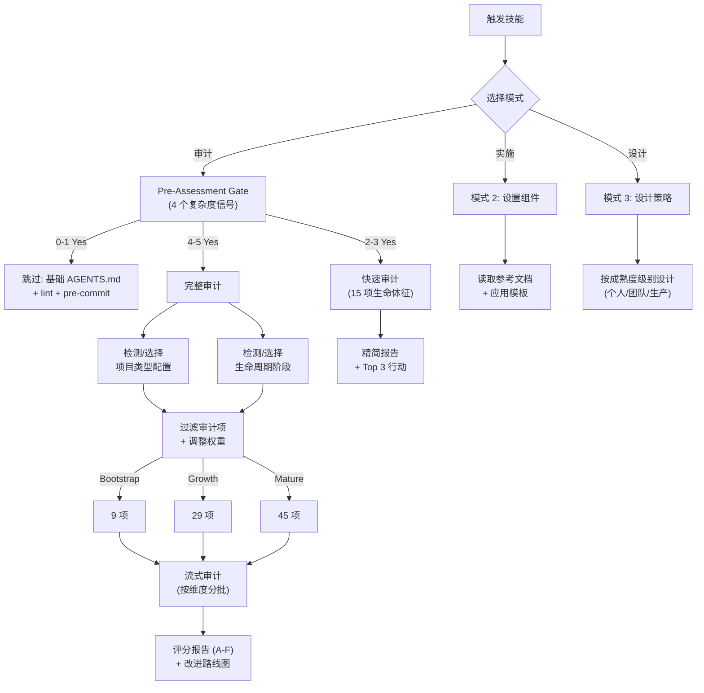

# Harness Engineering Guide（Harness 工程指南）

一个全面的技能，用于审计、设计和实施 AI 编码代理的环境约束和反馈循环。支持**快速审计**（15 项生命体征检查）和**完整审计**（45 项），覆盖 **10 种项目配置**、**11 种语言生态**、**3 个生命周期阶段**、**25 个反模式** 和 **6 个平台适配器**。

## 什么是 Harness Engineering？

**Agent = Model + Harness。** Harness 是围绕模型的一切：工具访问、上下文管理、验证、错误恢复和状态持久化。

从控制论的角度，每个有效的 harness 都实现了四个要素：

| 要素 | 在 Harness 中 | 示例 |
|------|-------------|------|
| **目标状态** | 架构文档、质量标准、完成标准 | ARCHITECTURE.md, lint 规则 |
| **传感器** | 测试、linter、日志、指标、截图 | CI 检查、Playwright |
| **执行器** | 自动修复、CI 门控、回滚 | pre-commit hooks |
| **反馈循环** | CI 失败→修复→通过、评审→lint 规则 | 质量分数趋势 |

缺少任何一个要素，系统就是**开环的** —— 无法自我纠正。

## 快速开始

对 AI 代理说以下任何一句话即可触发此技能：

- "审查我的仓库的 AI 编码就绪度"
- "审计这个仓库的 harness 成熟度"
- "快速检查我的仓库 harness 健康度"
- "为我的项目设置 AGENTS.md"
- "为我的新项目设计 harness 策略"
- "为什么我的 AI agent 总是写出烂代码？"

## 三种模式

### 模式 1：审计
评估仓库的 harness 成熟度，覆盖 8 个维度。提供两种深度：

- **快速审计** — 15 项生命体征检查，覆盖全部 8 个维度。精简报告 + Top 3 改进行动。约 30 分钟。由 Pre-Assessment Gate（2-3 个 Yes）或 `--quick` 标志触发。
- **完整审计** — 全部 45 项评分。可按**项目类型配置文件**和**生命周期阶段**进行配置。输出 A-F 分级报告和详细改进路线图。支持 monorepo 逐包审计。

### 模式 2：实施
按需设置具体的 harness 组件：AGENTS.md、CI 流水线、lint 规则、测试策略等。提供多个 CI 平台和语言生态的模板。

### 模式 3：设计
设计完整的 harness 策略，按团队规模分为三个成熟度级别（个人/小团队/生产组织）。

## 运行机制



## 功能特性

### 项目类型配置（10 种配置）
根据项目类型调整审计维度权重并跳过不相关的检查项。旧的细粒度名称（如 `frontend-spa`）通过 `profile_aliases` 映射到主配置。

| 配置文件 | 覆盖范围 | 重点 |
|---------|---------|------|
| `frontend` | SPA、SSR/SSG、浏览器扩展 | UI 可见性、E2E 测试、组件架构 |
| `backend` | API 服务、微服务 | 可观测性、安全、分布式追踪 |
| `fullstack` | 全栈单体应用 | 默认权重、依赖方向 |
| `library` | 库、CLI 工具、包 | 测试、机械约束、减少可观测性要求 |
| `client-app` | 桌面、移动应用 | UI 自动化、多进程架构 |
| `system-infra` | 系统级、嵌入式、游戏、智能合约 | 安全、回滚、类型安全 |
| `data-ml` | ML 管线、ETL、数据处理 | 长时间任务、持久化执行、进度跟踪 |
| `devops-iac` | IaC、脚本、自动化 | 安全护栏、人工确认、回滚 |
| `monorepo` | 多包仓库 | 跨包边界、熵管理 |
| `ai-agent-runtime` | Agent 框架、LLM 编排器 | 会话持久化、工具协议信任、Agent 可观测性 |

### 生命周期阶段（3 个阶段）
按项目成熟度减少审计范围：

| 阶段 | 活跃项 | 重点 |
|------|--------|------|
| **Bootstrap**（<2k LOC） | 9 项 | 仅基础项 |
| **Growth**（2k-50k LOC） | 29 项 | 约束 + 测试 + 早期反馈循环 |
| **Mature**（50k+ LOC） | 45 项 | 全量审计 |

### 多生态支持（11 种生态）
Node.js/TypeScript、Python、Go、Rust、Ruby、Java、C#/.NET、Swift、Kotlin、Dart/Flutter、PHP

**边界强制模板**（item 2.5）覆盖 6 种生态：
ESLint (JS/TS)、import-linter (Python)、depguard (Go)、clippy + Cargo workspace (Rust)、ArchUnit (Java)、deptrac (PHP)。
其余生态提供检测规则和 CI 命令；边界规则需手动配置。

### Pre-Assessment Gate（预评估门控）
基于复杂度信号的路由机制，匹配审计深度与项目规模：

| 信号 | 跳过 | 快速审计 | 完整审计 |
|------|------|---------|---------|
| **代码量** | <500 LOC | 500–10k LOC | >10k LOC |
| **贡献者**（人类+Agent） | 1 | 2–5 | >5 |
| **CI 成熟度** | 无 | 基础（1-2 个 job） | 多 job 流水线 |
| **AI Agent 角色** | 未使用/偶尔使用 | 常规辅助 | 主要开发流程 |

路由规则：取所有信号中的**最高级别**。阈值为经验性启发式规则，处于边界附近的项目应由审计者自行判断。用户可随时覆盖。

### 双层评估模型
审计评分分离脚本检测（Tier 1）和 LLM 评估（Tier 2）：

- **Tier 1 — 脚本预检**：`dimension-scanners.sh` 采集结构信号（文件存在性、行数、框架检测、CI 内容分析）。快速、确定性、可复现。
- **Tier 2 — LLM 终评**：LLM 将脚本输出作为证据，读取文件后做 PASS/PARTIAL/FAIL 判断。处理脚本无法回答的质量问题。

每个检查项携带 `script_role` 字段：`definitive`（6 项 — 脚本输出即最终评分）、`prescreen`（27 项 — 脚本提供证据，LLM 决定）、`none`（12 项 — 纯 LLM/人工评估）。`data/checklist-items.json` 中的 `script_output_mapping` 完整覆盖全部 45 项：有映射的项指向对应 JSON 输出路径，`none` 项显式标注为 `no_script_signal`。详见 `references/scoring-rubric.md` § Two-Tier Assessment Model。

### 增强审计脚本
超越文件存在性的内容级分析：
- Agent 指令文件质量信号（行数、实质内容行数、非空检查）
- 结构化日志框架检测
- 指标/追踪配置检测
- AGENTS.md 质量分析（行数、文档链接、命令引用）
- 测试文件比例制抽样与断言模式检测（按 20% 比例抽样，下限 20 上限 50；检查 `describe`/`it`/`test`/`expect`/`assert` 等模式）及 per-directory 文件分布输出，供 LLM 进行分层分析
- Init 脚本内容深度检查（区分空壳和真实脚本）
- 技术债务密度扫描（TODO/FIXME/HACK）
- Monorepo 自动检测和包发现
- **快速模式**：15 项生命体征快速分诊（`--quick` / `-Quick`）
- **蓝图模式**：缺口分析 + 优先级推荐 + 模板映射
- **持久化模式**：将蓝图保存到 `harness-system/MASTER.md`，跨会话复用
- **多输出格式**：JSON、Markdown、Blueprint

### 多平台模板
- **CI**：GitHub Actions、GitLab CI、Azure DevOps
- **Lint 边界规则**：ESLint (JS/TS)、import-linter (Python)、depguard (Go)、clippy (Rust)、ArchUnit (Java)、deptrac (PHP)
- **环境恢复**：Bash 和 PowerShell

## 目录结构

```
harness-engineering-guide/
├── SKILL.md                           ← Agent 入口（~190 行，薄指令层 + Quick Reference）
├── skill.json                         ← Skill 元数据（名称、版本、平台、关键词）
├── README.md                          ← 英文版
├── README.zh.md                       ← 你在这里（中文版）
├── data/
│   ├── profiles.json                  ← 10 种项目类型配置（含 variants）及权重覆盖
│   ├── stages.json                    ← 3 个生命周期阶段及活跃审查项子集
│   ├── ecosystems.json                ← 11 种生态检测规则和工具映射
│   └── checklist-items.json           ← 45 项机器可读格式
├── scripts/
│   ├── harness-audit.sh               ← CLI + 评分 + 输出格式化 (Bash)
│   ├── harness-audit.ps1              ← CLI + 评分 + 输出格式化 (PowerShell)
│   └── utils/
│       ├── dimension-scanners.sh      ← 全 8 维度检测逻辑 (Bash)
│       └── dimension-scanners.ps1     ← 全 8 维度检测逻辑 (PowerShell)
├── templates/
│   ├── universal/                     ← 语言无关模板（5 个文件）
│   ├── ci/                            ← CI 模板：GitHub Actions、GitLab、Azure
│   ├── linting/                       ← 边界规则：ESLint、import-linter、depguard、clippy、ArchUnit、deptrac
│   └── init/                          ← 环境恢复：Bash、PowerShell
├── reports/                           ← 临时审计报告输出目录（不提交）
├── examples/                          ← 黄金参考审计报告（已提交）
├── references/                        ← 深度参考文档（20 个文件）
│   ├── adversarial-verification.md    ← 对抗性验证（模式 + prompt 模板 + 平台实现指南）
│   ├── anti-patterns.md               ← 25 个反模式及快速诊断表
│   ├── checklist.md                   ← 8 维度 45 项审计清单
│   ├── scoring-rubric.md              ← 评分方法论、维度消歧、保守性校准、成熟度标注
│   ├── report-format.md               ← 审计报告模板和命名规范
│   ├── control-theory.md              ← 控制论基础
│   ├── improvement-patterns.md        ← 快速改进、战略投资、关键指标、常见痛点
│   ├── automation-templates.md        ← 缺口驱动的模板决策树
│   ├── monorepo-patterns.md           ← Monorepo 审计和设计模式
│   ├── platform-adaptation.md         ← 跨平台配置映射（6 个平台）
│   └── ...                            ← 更多参考文档（agents-md-guide、ci-cd-patterns 等）
└── evals/
    └── evals.json                     ← 8 个真实仓库评估基准（5 个仓库，OpenClaw x4）
```

## 审计脚本用法

```bash
# 快速审计（15 项生命体征检查）
bash scripts/harness-audit.sh /path/to/repo --quick
bash scripts/harness-audit.sh /path/to/repo --quick --profile backend-api

# 基本审计（JSON 输出，向后兼容）
bash scripts/harness-audit.sh /path/to/repo

# 指定项目类型
bash scripts/harness-audit.sh /path/to/repo --profile backend-api

# 指定生命周期阶段
bash scripts/harness-audit.sh /path/to/repo --stage bootstrap

# Markdown 扫描报告
bash scripts/harness-audit.sh /path/to/repo --format markdown

# 蓝图：完整的缺口分析 + 推荐方案
bash scripts/harness-audit.sh /path/to/repo --profile backend-api --stage growth --blueprint

# 持久化：将蓝图保存到仓库的 harness-system/MASTER.md
bash scripts/harness-audit.sh /path/to/repo --profile backend-api --stage growth --persist

# Monorepo 模式
bash scripts/harness-audit.sh /path/to/repo --monorepo

# 输出到文件
bash scripts/harness-audit.sh /path/to/repo --blueprint --output reports/

# PowerShell 等价
pwsh scripts/harness-audit.ps1 -RepoRoot /path/to/repo -Quick
pwsh scripts/harness-audit.ps1 -RepoRoot /path/to/repo -Profile backend-api -Stage growth
pwsh scripts/harness-audit.ps1 -RepoRoot /path/to/repo -Blueprint
pwsh scripts/harness-audit.ps1 -RepoRoot /path/to/repo -Persist
```

## 关键参考

- **OpenAI**：5 个月内交付 100 万行代码，零人工编写 —— 关键是 harness 投资，而非模型升级
- **LangChain**：仅改变 harness（不改模型），Terminal Bench 2.0 得分从 52.8% 跳升至 66.5%（Top 30 → Top 5）
- **Anthropic**：生成器-评估器分离是长时间运行代理最有效的 harness 模式
- **Google DeepMind**：Gemini Deep Think 的 Aletheia 代理使用生成→验证→修正循环和平衡提示（同时证明/反证）—— 证实了更好的脚手架在更低的计算成本下能产出更高质量的推理

---

## 术语表

本文档中英文术语的统一翻译规范。标题保留英文原名，首次出现时括号注释中文，正文统一使用英文术语。

| 英文 | 中文 | 说明 |
|------|------|------|
| Harness | Harness | 首次使用时标注中文，后续使用英文 |
| Harness Engineering | Harness 工程 | |
| Adversarial Verification | 对抗性验证 | "对抗性"强调系统性对抗，区别于一般性"对抗" |
| Entropy Management | 熵管理 | |
| Progressive Disclosure | 渐进式披露 | |
| Generator-Evaluator | 生成器-评估器 | |
| Circuit Breaker | 断路器 | |
| Feedback Loop | 反馈循环 | |
| Mechanical Constraints | 机械约束 | 指 CI/linter 等确定性门控 |
| Context Engineering | 上下文工程 | |
| Durable Execution | 持久化执行 | |
| Cache Stability | 缓存稳定性 | |
| Safety Rails | 安全护栏 | |
| Anti-Rationalization | 反合理化 | 指验证代理抵抗自我合理化倾向 |
| Maturity Annotation | 成熟度标注 | PASS 项的 [basic]/[advanced]/[exemplary] 标注 |
